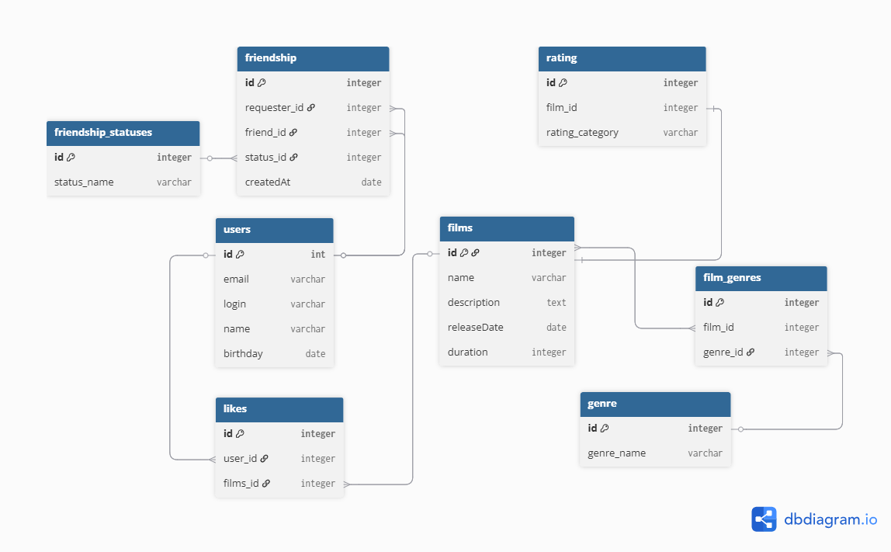

# java-filmorate
Бэкенд для сервиса, который работает с фильмами и оценками пользователей, а также возвращает топ-5 фильмов, рекомендованных к просмотру.

# Схема базы данных


### Получить список фильмов с жанрами:

---

```SELECT 
  fl.name AS film_name, 
  g.genre_name
FROM films fl
JOIN film_genres fg ON fl.id = fg.film_id
JOIN genre g ON fg.genre_id = g.id;```

### Получить рейтинг фильма:

---

```html
SELECT 
  r.rating_category, 
  COUNT(*) AS rating_count
FROM rating r
WHERE r.film_id = [ID_ФИЛЬМА]
GROUP BY r.rating_category;```

### Получить информацию о пользователе:

---

```html
SELECT 
  id, 
  email, 
  login, 
  name, 
  birthday
FROM users 
WHERE id = [ID_ПОЛЬЗОВАТЕЛЯ];```

### Получить топ‑5 фильмов по количеству лайков

---

```html
SELECT 
  fl.id AS film_id,
  fl.name AS film_name,
  COUNT(l.id) AS likes_count
FROM 
  likes l
JOIN 
  films fl ON l.films_id = fl.id
GROUP BY 
  fl.id, fl.name
ORDER BY 
  likes_count DESC
LIMIT 5;```

### Получить все жанры, представленные в базе данных:

---

```html
SELECT * FROM genre;```

## Найти фильмы, выпущенные после определённой даты:

---

```html
SELECT 
  id, 
  name, 
  releaseDate
FROM films 
WHERE releaseDate > '[ДАТА]';```


